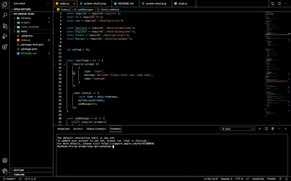
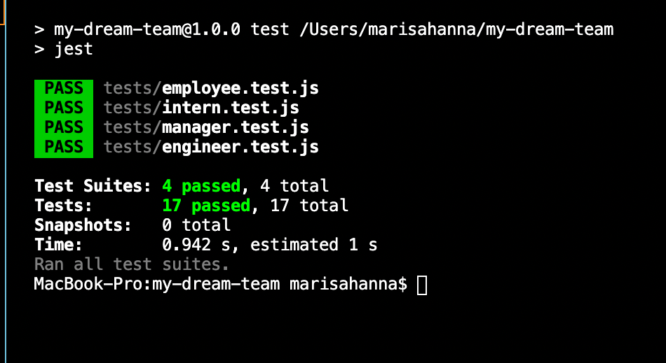

#       Team Profile Generator

#       Description

    This project demonstrates how to execute the npm Jest, and npm Inquirer packages through the CLI to dynamically generate an HTML page based on user input. The user will answer a series of questions about their team name, how many people will contribute to their team, and what role they will play.  

#       Video

[Video Link](https://youtu.be/p7kIX-H24ns)

#       Images

#       Languages Used

        *HTML
        *Node.js
        *JavaScript
        *CSS
        *Bootstrap

#       Installation 

        For installation, open Node.js through your command line. Then run npm install to bring in all required dependencies.

#       Tests

        This project was tested using JavaScript constructor functions for each team memeber.
        

 

#       Contributors

        Marisa Hanna

